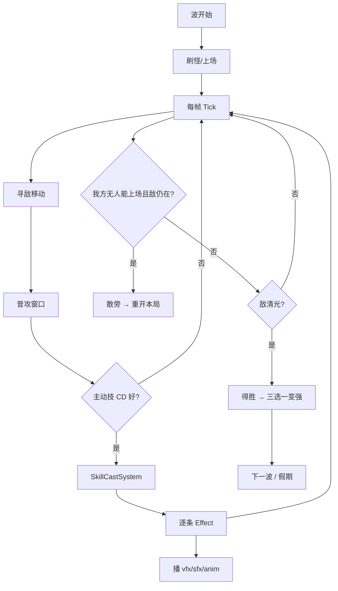

# 战斗行为 · 调表与实现（我和我的龙兄南弟）

定案摘要：**不上 Unity DOTS**。单位仍是 GameObject（`BattleUnit`）；技能/Buff/伤害走 **数据驱动 + 轻量 System**（类 ECS 思路、纯 C#）。这是 OOP 表现层 + System 逻辑层，不是二选一死磕。

关联：`docs/技能设计约束.md`、`docs/人物刻画与羁绊.md`、表 `人物&怪物.xlsx` / `技能.xlsx`。

---

## 1. 技能 Id：string key（已定）

| 表 | 主键 | 约定 |
|----|------|------|
| `SkillIndex.id` | **string** | `{归属}_{动作}`，一看就知道是谁的 |
| `SkillEffect.id` | **string** | `{技能id}_{效果短名}` |
| `RoleList.skill_ids` | string 列表 | 跳 `TbSkillIndex` |
| `FusionSkill.grant_skill_id` | string | 跳融合技 |

示例：

```text
CS_lixin.skill_ids → cs_lixin_gamble | campus_courage | cs_lixin_crunch
cs_lixin_gamble.effect_ids → cs_lixin_gamble_dmg
SkillIndex.owner_id → CS_lixin | campus | fusion | eng_xie …
```

共享池：`campus_*`（校园技）、`mow_*`（召唤单位）、`fusion_*`（羁绊技）、
`loot_*`（每人最多 1 个局内临时技能，后获得会替换）。

调表只改 Excel → `gen导表.bat`，战斗代码按 id 查表，不写死数字。

---

## 2. OOP 还是 ECS？怎么挂技能

| 方案 | 结论 |
|------|------|
| 纯 OOP：一人一个 `XxxSkill : MonoBehaviour` | 否。组合爆炸，热更难测 |
| Unity DOTS/Entities | **不上**（HybridCLR/表现成本） |
| **定案** | `BattleUnit`（OOP 表现）+ 运行时组件数据 + 全局 System |

```text
TbRoleList / TbSkillIndex / TbSkillEffect / TbFusionSkill
        ↓ 开局/招人时装配
BattleUnit (GameObject)
  + CombatStats      hp/atk/move/armor
  + SkillSlots[]     skillId, cdLeft, level, unlocked
  + BuffList         buffId, stacks, remain
  + FactionTags      来自表 + 局内临时
  + Presenter        播 vfx/sfx/anim（只听事件）
        ↓ 每帧 / 事件
BrothersBattleController（编排：波次、散旁、得胜）
  TargetingSystem
  SkillCastSystem     CD到了→读表→派发 Effect
  BuffSystem
  DamageSystem
  SummonSystem
  FusionSystem        扫场上 tags → 授/撤 fusion skill
  PresentationSystem  订阅 Cast/Hit/Die 事件
```

**个体技能怎么挂：** 不挂脚本类，挂 **SkillSlot 数据**（skillId + cd + lv）。施放时 `SkillCastSystem` 查 `TbSkillIndex` → 逐条 `TbSkillEffect`。要特殊逻辑时用 `kind` 分发，极少数再写 `IEffectHandler` 插件，而不是一人一个类。

---

## 3. 战斗行为时序（一波内）



### CD

- 表字段 `SkillIndex.cd`（秒）。被动 `cd=0` 且 `Passive`：入场装一次或按 tick 光环。
- 运行时 `SkillSlot.cdLeft`；施放成功后 `= cd / (1+cdr)`。
- 波间不清全部 CD（保持压力）；假期可重置（表或常量）。

### 回合（波）变强 — Rogue 上瘾点

| 时机 | 玩家获得 | 敌变强 |
|------|----------|--------|
| 清波三选一 | 属性 / 临时技能 / 攻击核心 / 人物好感 / 事件 | 按超过3人的数量增加怪量、刷新速度、精英率 |
| 假期 | 养伤、广告培养点 | — |
| 就业解锁年 | 硕/博就业技「更值钱」开闸 | 社会波主题更狠 |

原则：**失败有明确原因（散旁页）+ 一键重来**；局外养成保留 → 「再来一局必过」上瘾。不要惩罚删档。

### 死亡 / 失败

| 状态 | 行为 |
|------|------|
| 单人倒地 | 养伤（约半年级），本波不能上场；不是永死 |
| **散旁** | 场上 **0** 可上场兄弟且敌仍在 → 本局结束，局外保留 |
| 得胜 | 存活回血比例（现 35%）→ 三选一 |

---

## 4. 组合标签与融合技

1. 每人 `faction_tags`（表）。  
2. `FusionSystem` 每波开始（或招人后）扫场上 **派系并集**。  
3. 命中 `TbFusionSkill.required_tags`（且 `require_job_unlocked`）→ 给指定单位或「队共享槽」加上 `grant_skill_id`。  
4. 人员离场不满足则撤融合技。

优先落地：`bond_overload`（Mechanical|Energy → `fusion_overload`）。

融合技也是普通 `SkillIndex` 行，`show_tags` 含 `Fusion`，CD 通常更长。

---

## 5. 怎么调表 vs 怎么做表现

### 调数值（策划 / 你）

| 想改 | 改哪 |
|------|------|
| 谁更肉/更疼/更快 | `RoleList.base_hp/atk/move` |
| 技能多久放一次 | `SkillIndex.cd` |
| 打多疼、奶多少、盾多厚 | `SkillEffect.value/ratio/duration/radius` |
| 特效换皮 | `vfx_key` / `sfx_key` / `anim_trigger`（资源表或 Addressable） |
| 羁绊条件 | `FusionSkill.required_tags` |

**不要**为调伤害去改 C#。Unity 侧以后可做 Odin 只读预览条，写回仍以 Excel+导表为准。

### 做表现（程序）

`PresentationSystem` 只订阅：

- `OnSkillCast(unit, skillId)` → `anim_trigger` + 读第一条 effect 的 vfx  
- `OnEffectHit(target, effectId)` → `vfx_key` / `sfx_key`  
- `OnUnitDown` / `OnSanpang` / `OnWin`

资源约定：`Bundle` 下按 key 加载；缺失则 Log 一次用占位色块，不打断战斗。

---

## 6. 实现状态（可跑竖切）

已落地：

1. string skill id + `FusionSkill` 表  
2. `CfgTables`（读 `Assets/Bundle/LubanConfig/*.json`）+ `RoleCatalog`  
3. `SkillCastSystem`：CD + InstantDamage / Heal / Shield / AddBuff / Summon  
4. `FusionSystem`：Mechanical+Energy → `fusion_overload`  
5. 开局角色 `CS_lixin`（猩哥）；人物通过 `CharacterEncounter` 多次相遇累积好感后集合
6. `RunRewardSystem`：配置化三选一、广告刷新排旧、强度预算
7. 团队攻击核心：普通 / 贯穿 / 连锁 / 溅射，后获得的核心替换旧核心
8. 章节上阵位：`RunChapterRule.base_active_slots`，`-1` 不限；广告每局按表扩编

暂缓（细化循环以后再补）：完整 YooAsset VFX、局内断点存档、小学生成长曲线可视化。

进游戏：主界面 → 我和我的龙兄南弟 → 出征小学。Console 应有 `[JojoP] CfgTables OK`。
